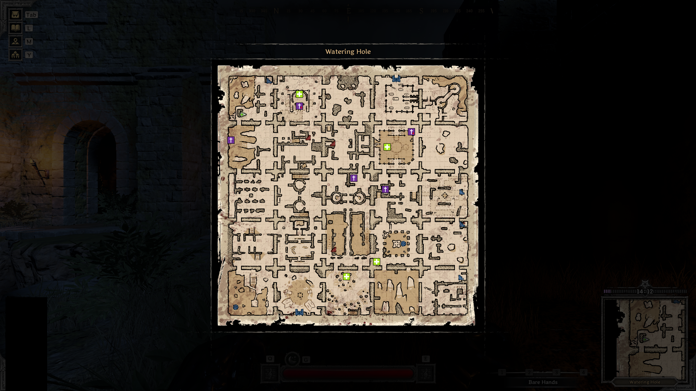

## Map overlay generator
This project captures an in-game map, splits into tiles, classifies each tile using a
trained ResNet18 model, and generates a transparent overlay that appears on top of the
game window.  

**annotatedMapGenerator.py** generates an image of the map, with the overlay on top,

**overlayGenerator.py** places the overlay directly over your game window.

Maps are randomly generated each game, with modules able to be generated in 4 different rotations, 
hence a trained model with currently ~130 classes is required to recognise each module and its rotation

## Example usage
Here's how the overlay looks in-game:  
  


## ⚠️ WARNING! ⚠️
As of 29/10/25 I have not yet confirmed if this is considered as cheating, but have contacted the game
devs addressing this.

I have made a "safer" version, which just generates an image instead of an overlay, called annotatedMapGenerator.py
which I'm confident is not cheating.

  
- This project is **not affiliated with Dark and Darker or its developers**.  
- The tool is provided for generating annotated maps/images.  
- Use at your own risk, I am **not responsible for bans, account restrictions, or any other consequences** that may arise from using this code.  
- It is your responsibility to ensure compliance with the game's Terms of Service.  

## Map Icons

| Icon | Meaning |
|------|---------|
|  | Health shrine on base level |
|    | Resurrection shrine on base level |
|  | Underground health shrine |
|  | Underground resurrection shrine |


## Controls
- **F9 →** Generate the overlay (map must be open in-game)  
- **M →** Toggle overlay visibility on/off
  - I've made this to match the default map toggle button, so it's synced with whenever you open the map
- **] →** Exit the program
  - don't think this works properly

## Requirements
- Game running in **Windowed Fullscreen** mode
- Make sure you have Python 3.9+ and install dependencies with pip:  
```bash
pip install torch torchvision pyautogui pillow keyboard pynput
```

## Future ideas
- Currently the overlay only shows locations of health and resurrection shrines, I may add more features,
e.g. rare chest, mobs, module names, etc.
  - I would then make each feature toggable so the overlay doesn't get clustered
- Currently the program only works for games running at 1920x1080 resolution, I may allow users to select
from common resolutions, or try to make it work for any res.
- Currently the overlay only works for 1 of 6 maps, I may add compatibility with more and eventually all maps
  - Unsure if for this I will create 1 big model, or 1 model per map, where the user has to select what map they are on
  each time, which corresponds to a certain model
- Package into an installer/GUI for easier use


  
